# Smart Traffic Management System - Class Diagram

## Class Classification Analysis

### Strong Classes (Core Domain Entities)
Strong classes are fundamental to the system with multiple responsibilities, complex relationships, and significant business logic.

#### 1. **User** ⭐⭐⭐⭐⭐
- **Purpose**: Authentication and authorization management
- **Responsibilities**: User authentication, profile management, permission control
- **Relationships**: One-to-Many with ActivityLog, One-to-One with UserProfile
- **Complexity**: High (Role-based access control, session management)

#### 2. **Vehicle** ⭐⭐⭐⭐⭐
- **Purpose**: Represents detected and tracked vehicles
- **Responsibilities**: Track vehicle data, calculate PCU, manage trajectory
- **Relationships**: Many-to-One with Intersection, One-to-Many with Violation
- **Complexity**: High (DeepSORT tracking, classification, trajectory)

#### 3. **TrafficSignal** ⭐⭐⭐⭐
- **Purpose**: Traffic light control and timing management
- **Responsibilities**: Signal state management, Webster's Method calculation, timing optimization
- **Relationships**: Many-to-One with Intersection, One-to-Many with SignalEvent
- **Complexity**: High (Adaptive algorithm, queue monitoring)

#### 4. **Violation** ⭐⭐⭐⭐
- **Purpose**: Traffic violation detection and recording
- **Responsibilities**: Violation detection, evidence capture, notification triggering
- **Relationships**: Many-to-One with Vehicle, Many-to-One with Intersection
- **Complexity**: High (Geofencing logic, confidence scoring)

#### 5. **Intersection** ⭐⭐⭐⭐
- **Purpose**: Core traffic intersection entity
- **Responsibilities**: Manage signals, track vehicles, define geofences
- **Relationships**: One-to-Many with Vehicle, One-to-Many with TrafficSignal, One-to-Many with Violation
- **Complexity**: High (Central hub for traffic management)

#### 6. **TrafficFlow** ⭐⭐⭐⭐
- **Purpose**: Real-time traffic flow data and analysis
- **Responsibilities**: Calculate flow metrics, predict congestion, track trends
- **Relationships**: Many-to-One with Intersection, One-to-One with Analytics
- **Complexity**: High (Simulation, prediction, PCU calculation)

---

### Weak Classes (Support/Infrastructure Entities)
Weak classes depend on strong classes, have limited responsibilities, and provide supporting functionality.

#### 1. **Alert** ⭐⭐
- **Purpose**: System notification and alerting
- **Responsibilities**: Alert creation, priority management, delivery
- **Relationships**: Many-to-One with Violation, Many-to-One with SystemEvent
- **Complexity**: Low (Straightforward notification mechanism)
- **Dependency**: Depends on Violation and system events

#### 2. **Analytics** ⭐⭐
- **Purpose**: Data visualization and reporting
- **Responsibilities**: Generate charts, export reports, analyze trends
- **Relationships**: Many-to-One with TrafficFlow, Many-to-One with Violation
- **Complexity**: Low (Aggregates data from stronger entities)
- **Dependency**: Consumes data from strong classes

#### 3. **WebSocketConnection** ⭐⭐
- **Purpose**: Real-time communication infrastructure
- **Responsibilities**: Connection management, event streaming, data synchronization
- **Relationships**: One-to-Many with User, One-to-Many with Event
- **Complexity**: Low (Configuration and event routing)
- **Dependency**: Infrastructure layer, depends on network availability

#### 4. **Map** ⭐⭐
- **Purpose**: Geospatial visualization and interaction
- **Responsibilities**: Render map, manage markers, display traffic overlay
- **Relationships**: One-to-Many with MapMarker, One-to-One with MapLayer
- **Complexity**: Low (Presentation layer)
- **Dependency**: Depends on data from Vehicle, TrafficSignal, Violation

#### 5. **ActivityLog** ⭐⭐
- **Purpose**: System activity and audit trail
- **Responsibilities**: Log operations, track user actions
- **Relationships**: Many-to-One with User, Many-to-One with Entity
- **Complexity**: Low (Simple logging mechanism)
- **Dependency**: Depends on User and various system events

---

## Class Diagram

```mermaid
classDiagram
    class User {
        -userId: UUID
        -email: String
        -username: String
        -passwordHash: String
        -role: Enum[ADMIN, USER]
        -profile: UserProfile
        -createdAt: DateTime
        -lastLogin: DateTime
        +login(email, password) Boolean
        +logout() void
        +updateProfile(data) void
        +changePassword(oldPwd, newPwd) void
        +hasPermission(action) Boolean
    }

    class UserProfile {
        -profileId: UUID
        -userId: UUID
        -fullName: String
        -avatar: String
        -preferences: JSON
        +updateProfile(data) void
        +getPreferences() JSON
    }

    class ActivityLog {
        -logId: UUID
        -userId: UUID
        -action: String
        -timestamp: DateTime
        -details: JSON
        +getActivityHistory(userId) List
        +logAction(user, action, details) void
    }

    class Vehicle {
        -vehicleId: String
        -type: Enum[HEAVY, MEDIUM, LIGHT]
        -coordinates: Point
        -bearing: Float
        -speed: Float
        -trajectory: List~Point~
        -confidence: Float
        -lastSeen: DateTime
        +calculatePCU() Float
        +updatePosition(coords, bearing, speed) void
        +getTrajectory() List~Point~
        +classify() Enum
    }

    class Intersection {
        -intersectionId: UUID
        -name: String
        -coordinates: Point
        -stopLines: List~LineString~
        -lanes: List~Lane~
        -signals: List~TrafficSignal~
        -vehicles: List~Vehicle~
        +getActiveVehicles() List~Vehicle~
        +getSignalStatus() List~TrafficSignal~
        +detectViolations() List~Violation~
    }

    class Lane {
        -laneId: UUID
        -intersectionId: UUID
        -direction: Float
        -capacity: Int
        +isCorrectDirection(bearing) Boolean
    }

    class TrafficSignal {
        -signalId: UUID
        -intersectionId: UUID
        -state: Enum[RED, YELLOW, GREEN]
        -cycleLength: Int
        -greenTime: Int
        -redTime: Int
        -queueLength: Int
        -flowRatio: Float
        +setState(state) void
        +calculateCycleLength(flowRatio) void
        +extendGreenTimer(duration) void
        +getWebsterCycleLength() Int
    }

    class SignalEvent {
        -eventId: UUID
        -signalId: UUID
        -previousState: Enum
        -newState: Enum
        -timestamp: DateTime
        +logStateChange(signal, oldState, newState) void
    }

    class Violation {
        -violationId: UUID
        -type: Enum[RED_LIGHT, WRONG_WAY]
        -vehicleId: String
        -intersectionId: UUID
        -timestamp: DateTime
        -location: Point
        -confidence: Float
        -snapshot: String
        -status: Enum[PENDING, CONFIRMED, DISMISSED]
        +getDetails() JSON
        +getSnapshot() String
        +triggerAlert() void
        +confirmViolation() void
    }

    class TrafficFlow {
        -flowId: UUID
        -intersectionId: UUID
        -timestamp: DateTime
        -vehicleCount: Int
        -avgSpeed: Float
        -density: Float
        -flowRatio: Float
        -totalPCU: Float
        +calculatePCU() Float
        +predictCongestion() Boolean
        +getForecast(timeRange) List
    }

    class Alert {
        -alertId: UUID
        -type: String
        -priority: Enum[CRITICAL, WARNING, INFO]
        -message: String
        -timestamp: DateTime
        -isRead: Boolean
        -relatedEntityId: UUID
        +notify(users) void
        +markAsRead() void
        +getPriority() Enum
    }

    class Analytics {
        -analyticsId: UUID
        -dataSource: String
        -timeRange: DateRange
        -data: JSON
        +generateReport(type) Document
        +createChart(chartType) Chart
        +exportData(format) File
        +getPeakHours() List
    }

    class WebSocketConnection {
        -connectionId: UUID
        -userId: UUID
        -status: Enum[CONNECTED, DISCONNECTED]
        -lastPing: DateTime
        +connect() void
        +disconnect() void
        +emit(event, data) void
        +subscribe(channel) void
    }

    class Map {
        -mapId: UUID
        -center: Point
        -zoom: Int
        -markers: List~MapMarker~
        -layers: List~MapLayer~
        +addMarker(marker) void
        +removeMarker(markerId) void
        +updateTrafficLayer(data) void
        +setCenter(coords) void
        +setZoom(level) void
    }

    class MapMarker {
        -markerId: UUID
        -location: Point
        -type: Enum[VEHICLE, VIOLATION, SIGNAL]
        -data: JSON
        +getInfo() String
        +update(data) void
    }

    class MapLayer {
        -layerId: UUID
        -name: String
        -type: Enum[TRAFFIC, HEATMAP, SIGNAL]
        -opacity: Float
        +setOpacity(value) void
        +toggle() void
    }

    %% Relationships
    User "1" -- "0..*" ActivityLog : performs
    User "1" -- "1" UserProfile : has
    User "1" -- "0..*" WebSocketConnection : maintains
    
    Vehicle "0..*" -- "1" Intersection : locatedAt
    Vehicle "1" -- "0..*" Violation : involved_in
    Vehicle "1" -- "0..*" TrafficFlow : contributesTo
    
    Intersection "1" -- "0..*" TrafficSignal : controls
    Intersection "1" -- "0..*" Vehicle : contains
    Intersection "1" -- "0..*" Lane : has
    Intersection "1" -- "0..*" Violation : detects
    Intersection "1" -- "0..*" TrafficFlow : monitors
    
    TrafficSignal "1" -- "0..*" SignalEvent : generates
    TrafficSignal "1" -- "1" Lane : controls
    
    Violation "0..*" -- "1" Alert : triggers
    Violation "0..*" -- "1" Analytics : analyzed_by
    
    TrafficFlow "0..*" -- "1" Analytics : provides_data
    
    WebSocketConnection "0..*" -- "1" User : connectedBy
    
    Map "1" -- "0..*" MapMarker : displays
    Map "1" -- "0..*" MapLayer : contains
    
    MapMarker "1" -- "1" Vehicle : represents
    MapMarker "1" -- "1" Violation : shows
    MapMarker "1" -- "1" TrafficSignal : marks
    
    Alert "0..*" -- "1" User : notifies
    
    ActivityLog "0..*" -- "1" User : tracks
```

---

## Class Relationships Summary

### One-to-One (1:1)
- User ↔ UserProfile
- TrafficFlow ↔ Analytics
- TrafficSignal ↔ Lane

### One-to-Many (1:M)
- User → ActivityLog (1 user performs many activities)
- Intersection → TrafficSignal (1 intersection has many signals)
- Intersection → Vehicle (1 intersection contains many vehicles)
- TrafficSignal → SignalEvent (1 signal generates many events)

### Many-to-One (M:1)
- Vehicle → Intersection (many vehicles at 1 intersection)
- Violation → Vehicle (many violations from 1 vehicle)
- Violation → Intersection (many violations at 1 intersection)

### Many-to-Many (M:M) - Implicit through weak classes
- Vehicle ↔ Alert (through Violation)
- Intersection ↔ Analytics (through TrafficFlow)

---

## Class Strength Assessment

### Strong Classes: 60%
1. User - Core authentication and authorization
2. Vehicle - Primary detection entity
3. Intersection - Central coordination hub
4. TrafficSignal - Key control system
5. Violation - Critical business logic
6. TrafficFlow - Essential data source

### Weak Classes: 40%
1. Alert - Supporting notification
2. Analytics - Supporting analytics layer
3. WebSocketConnection - Infrastructure
4. Map - Presentation layer
5. ActivityLog - Audit trail

---

## Key Design Patterns

### Inheritance Hierarchy
- **Base Entity**: Could have common properties (id, timestamp, metadata)
- **Alert Types**: Inherit from base Alert (ViolationAlert, SystemAlert)
- **Map Markers**: Inherit from base MapMarker (VehicleMarker, ViolationMarker, SignalMarker)

### Composition
- User composes UserProfile
- Intersection composes Lane
- Map composes MapMarker and MapLayer

### Association
- Strong classes associate with each other through many-to-many relationships
- Weak classes associate with strong classes as dependents

