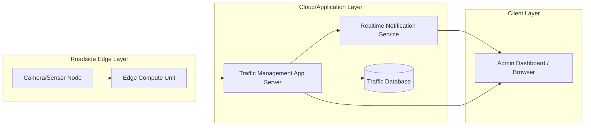

# Experiment 10 - Reverse Engineering in Java (Code to Model) and Deployment Diagram

## Theory
Reverse engineering derives UML models from existing source code to understand structure, dependencies, and runtime deployment.
It is commonly used when code already exists and the goal is to rebuild design documentation or analyze system behavior.
This process helps teams understand legacy systems, verify architecture, and communicate implementation details more clearly.

In a traffic management project, reverse engineering can reveal how sensors, processors, and alert services are connected in code, while a deployment diagram shows where those parts run at runtime.
Together, these views connect static code structure with the physical or logical environment in which the application operates.

## Java Code Sample (Input for Reverse Engineering)

```java
class SensorNode {
    private String sensorId;
    private String location;
}

class TrafficProcessor {
    public void analyze(SensorNode node) {
        AlertService alertService = new AlertService();
        if (node != null) {
            alertService.sendAlert("Traffic analyzed for sensor node");
        }
    }
}

class AlertService {
    public void sendAlert(String message) {
        // notification logic
    }
}
```

Note: Constructors/getters are omitted for brevity in this teaching example.
Also, `new AlertService()` inside `analyze` is intentionally simple for demonstration;
production code should use dependency injection or shared service instances.

## Reverse-Engineered Class Model (Code to UML)


## Deployment Diagram



Note: This is a simplified deployment architecture view using Mermaid flowchart notation.

## Result
Reverse engineering was performed from Java code to UML class model, and a deployment diagram was created for runtime architecture.
