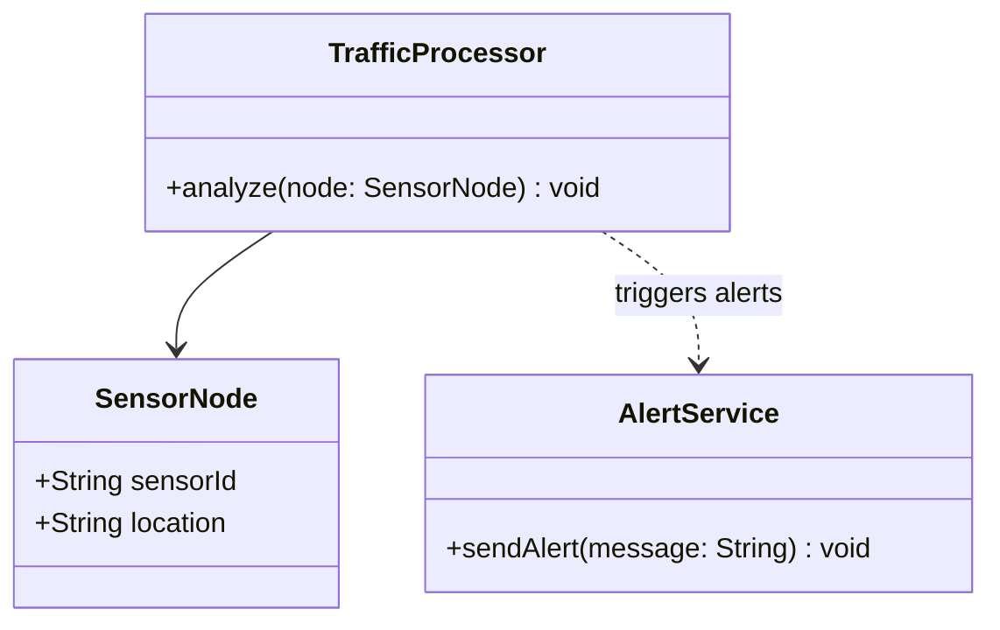
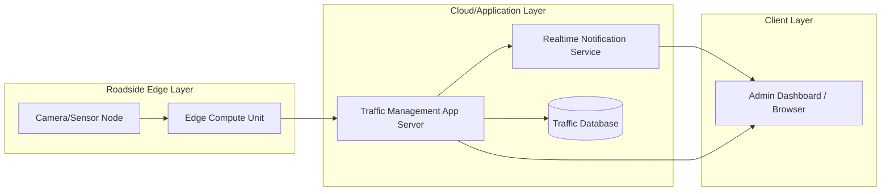

# Experiment 10 - Reverse Engineering in Java (Code to Model) and Deployment Diagram

## Theory
Reverse engineering derives UML models from existing source code to understand structure, dependencies, and runtime deployment.

## Java Code Sample (Input for Reverse Engineering)

```java
class SensorNode {
    String sensorId;
    String location;
}

class TrafficProcessor {
    void analyze(SensorNode node) {
        // traffic analytics logic
    }
}

class AlertService {
    void sendAlert(String message) {
        // notification logic
    }
}
```

## Reverse-Engineered Class Model (Code to UML)



## Deployment Diagram



## Result
Reverse engineering was performed from Java code to UML class model, and a deployment diagram was created for runtime architecture.
