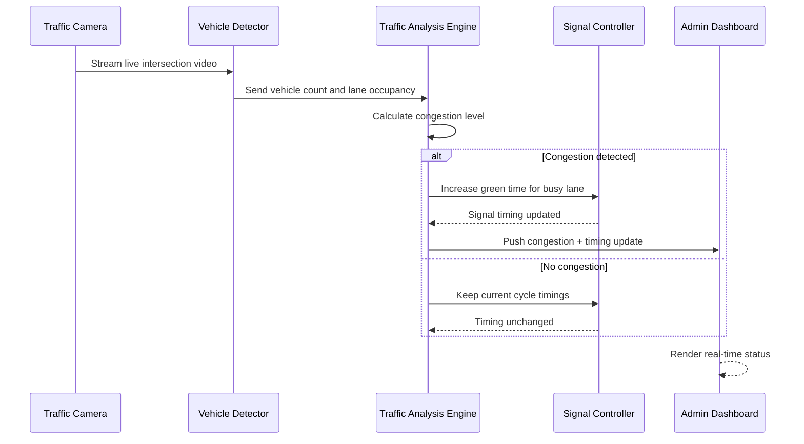
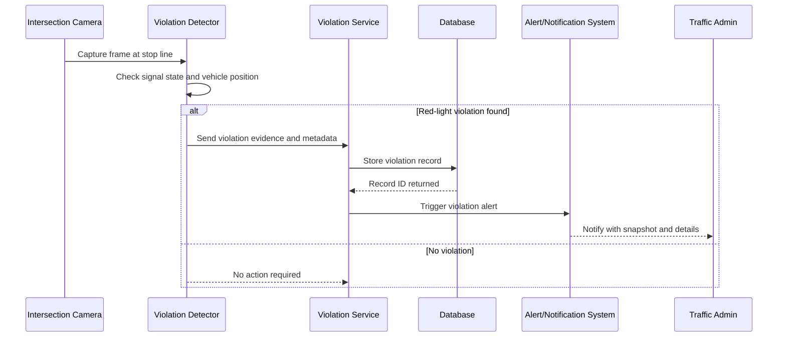

# Experiment 5 - Sequence Diagram (SE Lab)

## Theory
Sequence diagrams model time-ordered interactions between actors and system modules.
They show lifelines and messages in chronological order to capture runtime behavior.
They are useful for validating message flow, decision points, and real-time behaviors.

## Scenario 1: Adaptive Traffic Signal Control During Congestion

## Scenario 2: Red-Light Violation Detection and Alert Workflow

## Result
Two sequence-diagram scenarios were prepared:
1. Adaptive traffic signal control during congestion
2. Red-light violation detection and alert workflow
