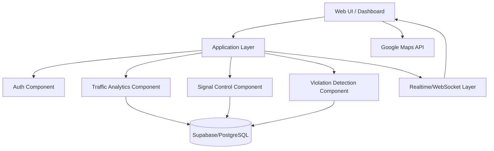

# Experiment 7 - Component Diagram (SE Lab)

## Theory
Component diagrams represent high-level software modules and the interfaces/dependencies between them.

## Component Diagram: Smart Traffic Management System

## Result
A component diagram was prepared showing major modules and integration points of the system.
