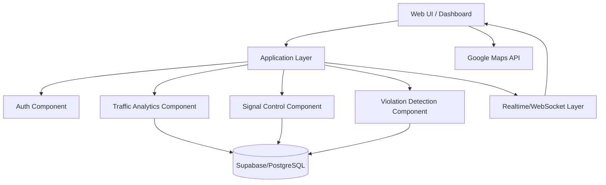

# Experiment 7 - Component Diagram (SE Lab)

## Theory
Component diagrams represent high-level software modules and the interfaces/dependencies between them.
They are used to describe how a system is partitioned into reusable, deployable, or replaceable building blocks.
These diagrams are helpful for architecture planning because they show the major services and the way they depend on one another.

For the smart traffic management system, a component diagram clarifies the separation between the UI, application services, authentication, analytics, signal control, violation handling, database access, and external map services.
It gives a quick architectural view of integration points and helps identify where changes in one module may affect another.

## Component Diagram: Smart Traffic Management System

Note: This is a simplified component representation using Mermaid flowchart syntax to show module dependencies.

## Result
A component diagram was prepared showing major modules and integration points of the system.
