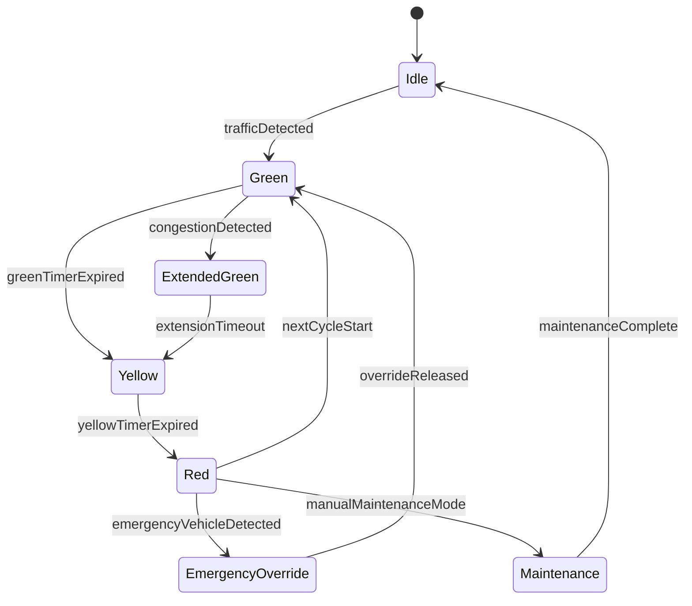

# Experiment 8 - State Chart Diagram (SE Lab)

## Theory
State chart diagrams model the lifecycle of an entity by defining states, transitions, and triggering events.

## State Chart: Traffic Signal Lifecycle

## Result
A state chart diagram was created for the traffic signal control state transitions.
