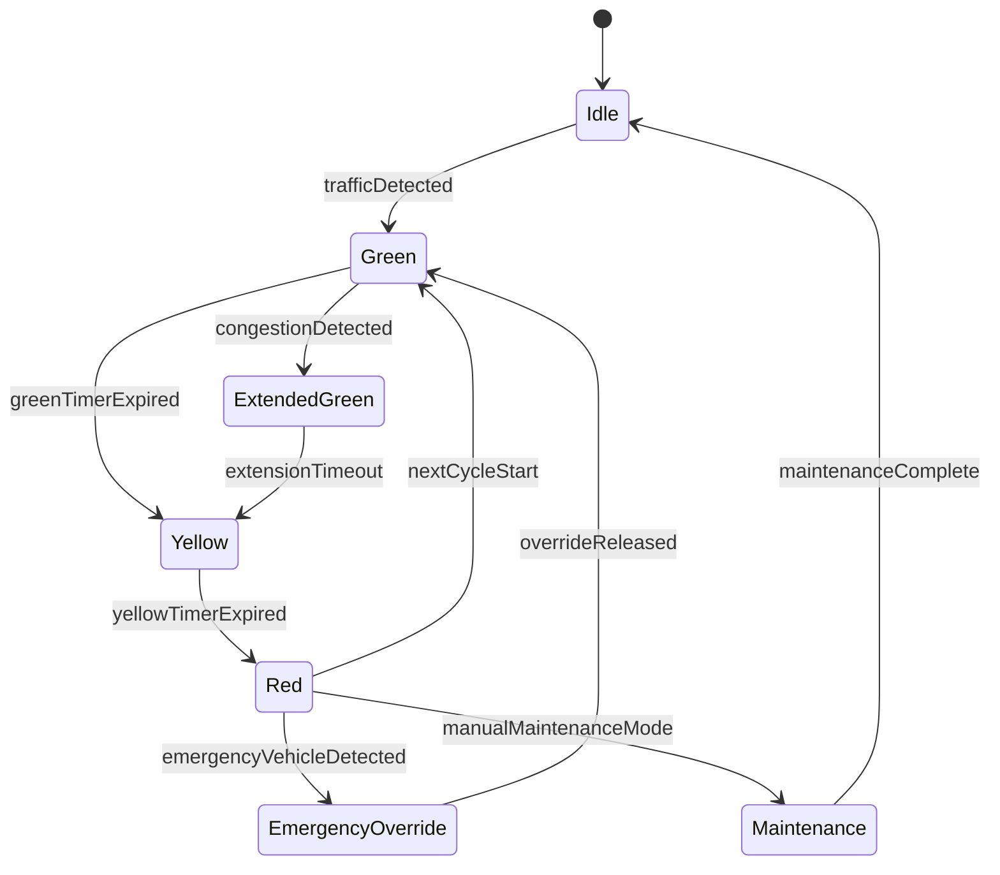

# Experiment 8 - State Chart Diagram (SE Lab)

## Theory
State chart diagrams model the lifecycle of an entity by defining states, transitions, and triggering events.
They are useful for systems where behavior changes based on events, timers, guards, or external conditions.
Unlike simple flow diagrams, they emphasize state persistence and allowed transitions at each point in time.

In traffic signal control, a state chart is ideal for showing how the signal moves between idle, green, yellow, red, extended green, emergency override, and maintenance modes.
This makes control logic easier to reason about, especially when handling congestion or special cases such as emergency vehicles.

## State Chart: Traffic Signal Lifecycle

## Result
A state chart diagram was created for the traffic signal control state transitions.
