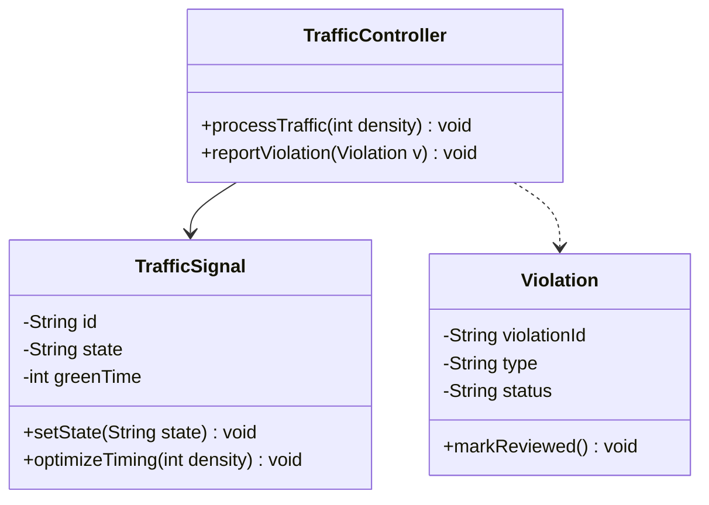

# Experiment 9 - Forward Engineering in Java (Model to Code)

## Theory
Forward engineering transforms UML models (classes, relationships, behavior) into source code.

## UML Class View Used for Conversion



## Java Code (Model-to-Code Output)

```java
class TrafficSignal {
    private String id;
    private String state;
    private int greenTime;

    public TrafficSignal(String id, String state, int greenTime) {
        this.id = id;
        this.state = state;
        this.greenTime = greenTime;
    }

    public void setState(String state) {
        this.state = state;
    }

    public void optimizeTiming(int density) {
        if (density > 80) {
            greenTime += 10;
        } else if (density < 30) {
            greenTime = Math.max(20, greenTime - 5);
        }
    }
}

class Violation {
    private String violationId;
    private String type;
    private String status;

    public Violation(String violationId, String type, String status) {
        this.violationId = violationId;
        this.type = type;
        this.status = status;
    }

    public void markReviewed() {
        this.status = "REVIEWED";
    }
}

class TrafficController {
    private final TrafficSignal signal;

    public TrafficController(TrafficSignal signal) {
        this.signal = signal;
    }

    public void processTraffic(int density) {
        signal.optimizeTiming(density);
    }

    public void reportViolation(Violation v) {
        v.markReviewed();
    }
}
```

## Result
Forward engineering was demonstrated by converting UML model structure into Java classes.
